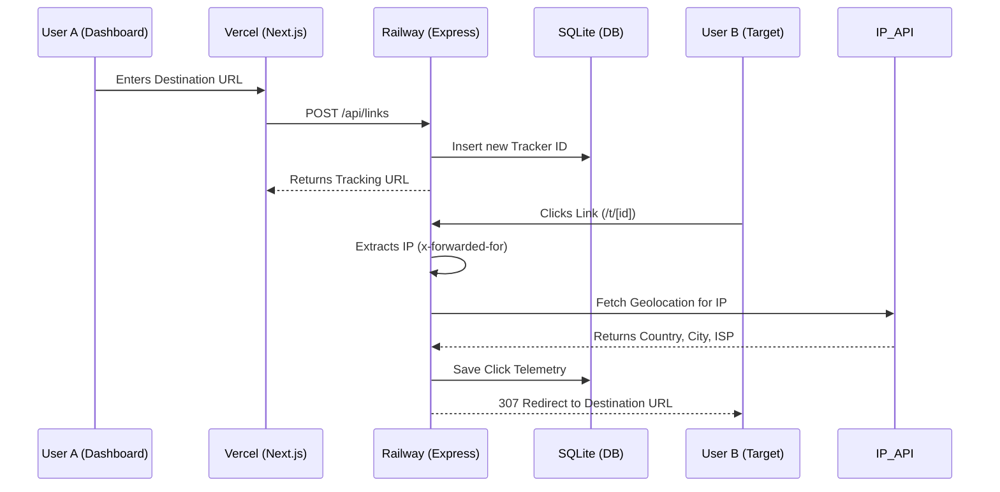

# GhostLink Tracker

GhostLink Tracker is a link tracking application designed to capture visitor IP addresses, perform geolocation analysis, and display the resulting telemetry on a web dashboard.

This repository features a decoupled architecture designed to bypass the ephemeral filesystem limitations of serverless platforms (such as Vercel) by separating the stateful backend API from the frontend UI.

## System Architecture

The project is split into two autonomous components:

1. **Frontend (Next.js & React)**
   - Contains the user interface and dashboard metrics.
   - Responsible for generating links and visualizing IP telemetry.
   - **Recommended Hosting Provider:** [Vercel](https://vercel.com)

2. **Backend (Express.js & SQLite)**
   - Located in the `/backend` directory.
   - Responsible for securely capturing headers (`x-forwarded-for`), fetching geolocation data from `ip-api.com`, and persisting records to a local SQLite database (`data.sqlite`).
   - **Recommended Hosting Provider:** [Railway.app](https://railway.app) (Requires persistent volumes to retain the SQLite database).

### Architecture Flow



## Local Setup

To run this application locally for development or testing:

1. **Clone the repository:**
   ```bash
   git clone https://github.com/DecentralizedJM/ghostlink-tracker.git
   cd ghostlink-tracker
   ```

2. **Start the Backend API (Port 3001):**
   ```bash
   cd backend
   npm install
   npm start
   ```

3. **Start the Frontend UI (Port 3000):**
   *(In a new terminal window)*
   ```bash
   npm install
   npm run dev
   ```

4. **Access the App:** 
   Open `http://localhost:3000` in your browser.

> **Note on Local Testing:** If the tracking link is opened from the local machine hosting the server, the captured IP will be `::1` or `127.0.0.1`. The system logs this as "Localhost / Local Network". To capture external geographic data locally, use a tunneling service such as `localtunnel` or `ngrok`.

## Remote Deployment Strategy

### 1. Deploying the Backend (Railway)
1. In the Railway dashboard, create a new service from this GitHub repository.
2. In **Settings -> General**, update the **Root Directory** to `/backend`.
3. In **Settings -> Volumes**, add a new persistent volume and mount it to `/data` *(Do NOT mount it to `/app` as it will overwrite your code!)*.
4. In **Variables**, add a new variable:
   - **Name**: `DATABASE_PATH`
   - **Value**: `/data/data.sqlite`
5. Go to **Networking** and generate a public domain (e.g., `track-api.up.railway.app`).

### 2. Deploying the Frontend (Vercel)
1. In the Vercel dashboard, import this repository.
2. Ensure the framework preset is set to **Next.js**.
3. In **Environment Variables**, add:
   - **Name**: `NEXT_PUBLIC_API_URL`
   - **Value**: `https://track-api.up.railway.app` *(The generated Railway domain from the previous step)*
4. Click Deploy. 

Once both services are deployed, the frontend application will route all telemetry data to the remote backend service for processing and storage.

## Contributing

Contributions, issues, and feature requests are welcome! 

1. Fork the Project
2. Create your Feature Branch (`git checkout -b feature/AmazingFeature`)
3. Commit your Changes (`git commit -m 'Add some AmazingFeature'`)
4. Push to the Branch (`git push origin feature/AmazingFeature`)
5. Open a Pull Request

## Disclaimer & Warning

> **⚠️ Educational Purposes Only**
> 
> This software is provided strictly for educational, administrative, and defensive security research purposes. The developers and contributors are not responsible for any misuse, illegal tracking, or unauthorized surveillance activities conducted with this tool. Ensure you comply with all local, state, and federal privacy laws before deploying or using this tool to track individuals. Do not use this tool on targets without their explicit consent.

## License

Distributed under the MIT License. 

```text
MIT License

Copyright (c) 2026 GhostLink Tracker Contributors

Permission is hereby granted, free of charge, to any person obtaining a copy
of this software and associated documentation files (the "Software"), to deal
in the Software without restriction, including without limitation the rights
to use, copy, modify, merge, publish, distribute, sublicense, and/or sell
copies of the Software, and to permit persons to whom the Software is
furnished to do so, subject to the following conditions:

The above copyright notice and this permission notice shall be included in all
copies or substantial portions of the Software.

THE SOFTWARE IS PROVIDED "AS IS", WITHOUT WARRANTY OF ANY KIND, EXPRESS OR
IMPLIED, INCLUDING BUT NOT LIMITED TO THE WARRANTIES OF MERCHANTABILITY,
FITNESS FOR A PARTICULAR PURPOSE AND NONINFRINGEMENT. IN NO EVENT SHALL THE
AUTHORS OR COPYRIGHT HOLDERS BE LIABLE FOR ANY CLAIM, DAMAGES OR OTHER
LIABILITY, WHETHER IN AN ACTION OF CONTRACT, TORT OR OTHERWISE, ARISING FROM,
OUT OF OR IN CONNECTION WITH THE SOFTWARE OR THE USE OR OTHER DEALINGS IN THE
SOFTWARE.
```
